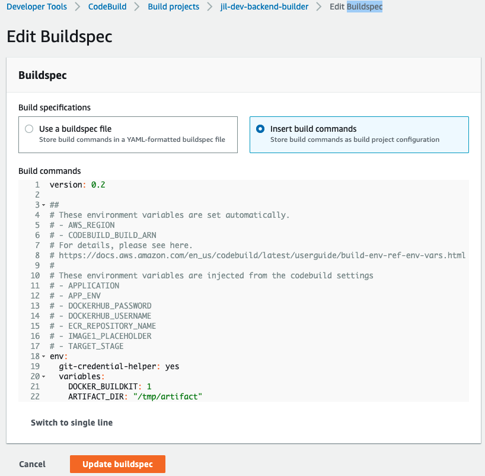

# aws-codebuild-resultbadge-python 🐳


[](https://github.com/tquangdo/aws-codebuild-resultbadge-python/issues/new)

## Build status:
---


## reference
[haitrungblog](https://haitrung.net/ci-task-voi-github-va-aws-codebuild/)


## step by step
### 1) create a repo
+ run process in repo:
1. Mặc định cấu hình life-cycle build dựa vào file `buildspec.yml` đặt ở thư mục root của source code
> buildspec.yml là file config life-cycle khi build project (appspec.yml là file config life-cycle khi deploy project)
+ hoac cach khac la dung `Insert build commands`

2. `buildspec.yml`
```yml
    build:
        commands:
            - echo "BUILD phase"
            - python test.py
```
3. `test.py`
```py
def test_codebuild():
    assert functions.test_module(2) == 5 // return FALSE
```
4. `functions/function.py`
```py
def test_module(n):
    return n*2; 
```

### 2) generate new token
https://github.com/settings/tokens 

### 3) create AWS CodeBuild build project `DoTQ_CodeBuildDemo_Master`
+ add source: choose 2) & 1)
+ webhook: check `Rebuild every time a code change is pushed to this repository`
> reponame in screenshoot is old: `test_aws_codebuild.git`
+ Build specifications: Chọn `Use a buildspec file` (l/q `buildspec.yml`)


### 4) copy badge URL
paste to  aws-codebuild-resultbadge-python/README.md → auto build OK

### 5) edit src code in 1) to return NG result
+ → auto build NG

+

